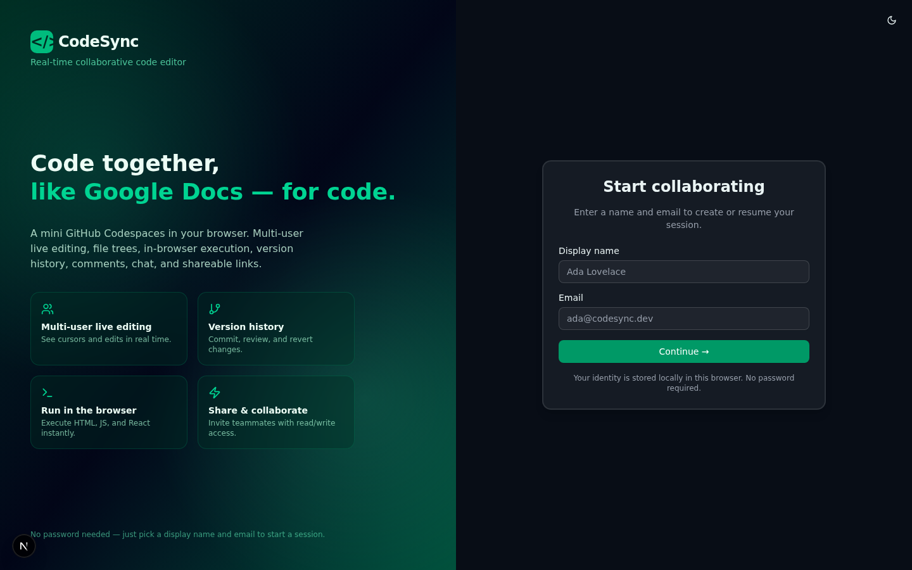
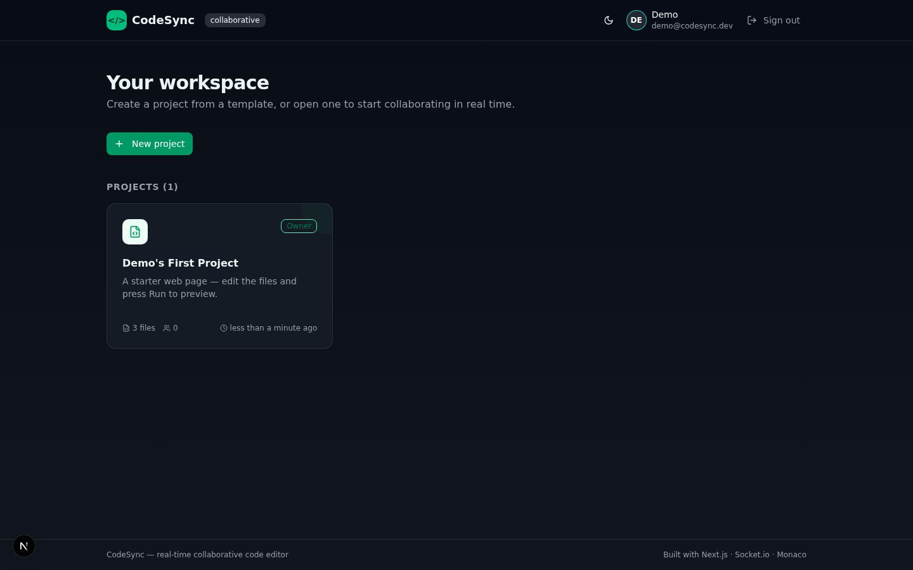
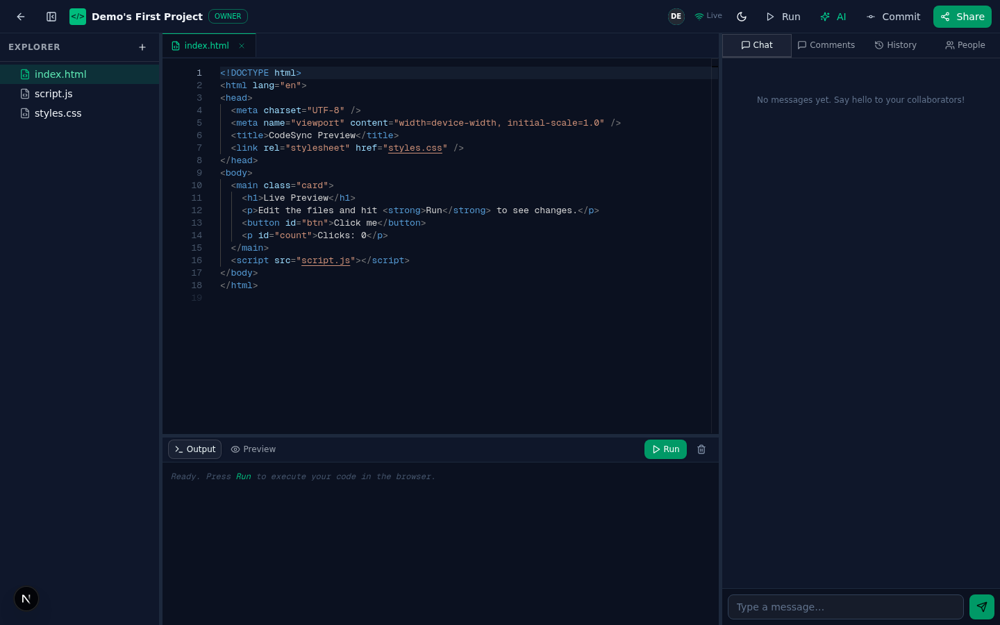
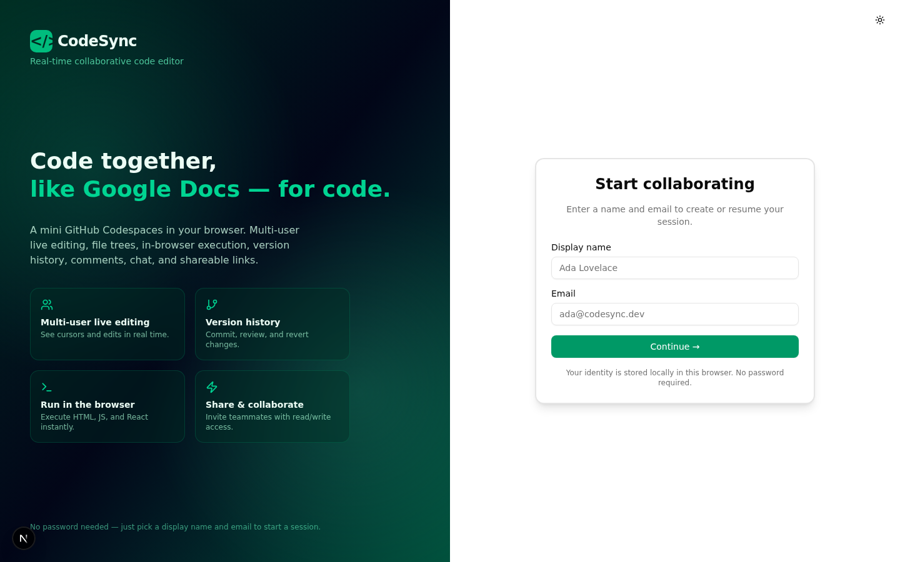
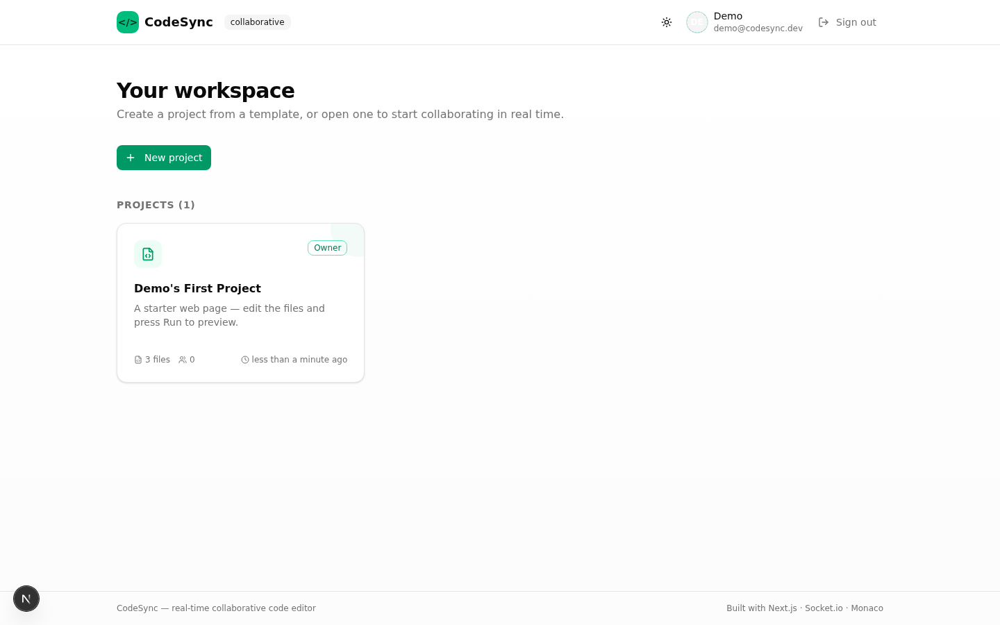
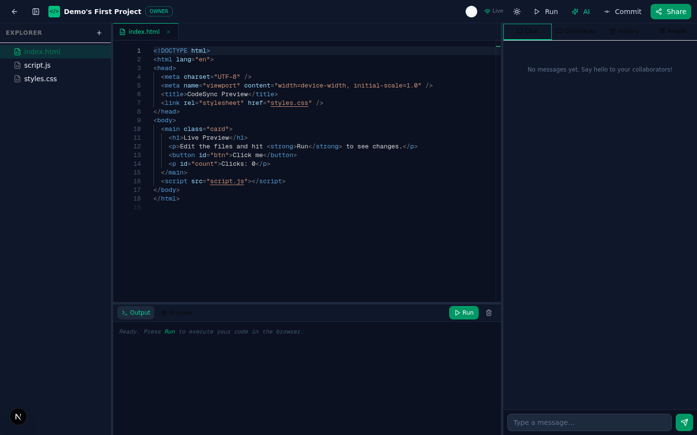

# CodeSync — Real-Time Collaborative Code Editor

A mini GitHub Codespaces + Google Docs for code. Multi-user live editing with presence and cursors, a file tree with tabs, an in-browser code runner, version history (git-style commits), inline comments, project chat, shareable links with permissions, and an AI pair-programming assistant — all in a single-page Next.js app.

Built with **Next.js 16**, **TypeScript** (strict), **Socket.io**, **Monaco Editor**, **Prisma/SQLite**, and the **Z.ai LLM SDK**.

---

## 📸 Screenshots

### Dark mode (default)

| Sign-in | Dashboard | IDE Workspace |
|:---:|:---:|:---:|
|  |  |  |

### Light mode

| Sign-in | Dashboard | IDE Workspace |
|:---:|:---:|:---:|
|  |  |  |

---

## ✨ Features

### Real-time collaboration
- **Multi-user live editing** — keystrokes sync instantly across connected peers
- **Presence** — see who's online with colored avatars; stale sessions auto-clean up
- **Remote cursors** — see other users' cursor positions and selections in real time
- **Authenticated sockets** — every Socket.io connection requires a signed handshake token minted from the session cookie; no identity spoofing
- **Typing indicators** with auto-clear safety net

### Editor workspace
- **Monaco editor** (the engine behind VS Code) with a custom dark theme
- **File tree** — nested folders, create/delete, per-file-type icons
- **Tabs** — multi-file editing with dirty indicators
- **Command palette** (`⌘⇧P` / `Ctrl+Shift+P`) — fuzzy search commands and files
- **Keyboard shortcuts** — `⌘S` commit, `⌘P` file open, `⌘B` sidebar, `⌘↵` run, `⌘/` focus chat

### Run code in the browser
- **Preview pane** — HTML/CSS/JS projects render live in a sandboxed iframe (assets auto-inlined)
- **Console output** — standalone JS/JSX executes in a sandboxed iframe with captured `console.*`
- **React support** — JSX transpiled in-browser via Babel standalone

### Version control
- **Git-style commits** — snapshot one or all files with a message and an 8-char hash
- **Version history** — per-file timeline with restore
- **Restore** — reverts file content and records a new version

### Collaboration & sharing
- **Inline comments** — click the editor gutter to comment on a line; comments sync live
- **Project chat** — real-time chat panel (deduped via client-generated message IDs)
- **Share links** — generate `READ` or `WRITE` links with optional expiry
- **Collaborator management** — invite by name/email with `READ`/`WRITE`/`ADMIN` permissions
- **Public projects** — toggle project visibility for read-only public access

### AI assistant
- **Pair-programming chat** powered by the Z.ai LLM SDK
- **Context-aware** — sends the active file's content and project file list
- **Quick actions** — "Explain this file", "Find bugs", "Suggest improvements", "Refactor"
- **Markdown rendering** with syntax-highlighted code blocks

### Dark mode
- **Three-way toggle** — Light / Dark / System (auto-detects OS preference)
- **Emerald-accented dark theme** — custom dark palette with emerald primary, ring, and accent colors
- **Persistent** — theme choice saved via `next-themes` (localStorage + cookie)
- **No flash** — `suppressHydrationWarning` + `disableTransitionOnChange` for a seamless load
- **IDE stays dark** — the Monaco editor workspace is always dark (like VS Code); the toggle controls the dashboard and auth gate

### Security
- **Signed httpOnly session cookies** — HMAC-signed `userId` cookie; can't be forged or read by JS
- **Fail-closed session secret** — production refuses to start without `CODESYNC_SESSION_SECRET`
- **Cookie attributes adapt to origin** — `SameSite=Lax` for localhost, `SameSite=None; Secure` for cross-origin preview domains
- **Zod input validation** on every API mutation (file paths reject traversal, emails validated, permissions enumerated)
- **Access by `userId` only** — display names never grant access (no same-name collision attacks)
- **Socket auth** — handshake token verified by the collab service using the shared secret

---

## 🏗️ Architecture

```
┌─────────────────────────────────────────────────────┐
│                    Browser (client)                  │
│  Next.js app (port 3000)                             │
│  ├── AuthGate / Dashboard / IDE Workspace            │
│  ├── Monaco editor + file tree + tabs                │
│  ├── Terminal panel (preview + console)              │
│  ├── Side panel (chat / comments / history / people) │
│  ├── Command palette + keyboard shortcuts            │
│  └── AI assistant panel                              │
│         │                            │               │
│         │ REST (cookie auth)         │ Socket.io     │
│         │   credentials: include     │ (auth token)  │
│         ▼                            ▼               │
├─────────────────────────────────────────────────────┤
│                 Gateway (Caddy :81)                  │
│   Forwards /?XTransformPort=<port> to localhost:N    │
└─────────────────────────────────────────────────────┘
         │                            │
         ▼                            ▼
┌─────────────────────┐    ┌─────────────────────────┐
│  Next.js API (:3000) │    │ Collab Service (:3003)  │
│  ├── Auth (cookie)   │    │  Socket.io server       │
│  ├── Projects CRUD   │    │  ├── Auth middleware    │
│  ├── Files CRUD      │    │  ├── Presence rooms     │
│  ├── Versions/commit │    │  ├── Cursor throttle    │
│  ├── Comments        │    │  ├── Inactivity sweep   │
│  ├── Chat            │    │  ├── Session migration  │
│  ├── Share links     │    │  └── Typing auto-clear  │
│  ├── Collaborators   │    └─────────────────────────┘
│  ├── AI (LLM)        │
│  └── Collab token    │
│         │            │
│         ▼            │
│  Prisma → SQLite     │
└─────────────────────┘
```

### Services
| Service | Port | Description |
|---------|------|-------------|
| Next.js app | 3000 | Main app + REST API + SSR |
| Collab service | 3003 | Socket.io real-time server (`mini-services/collab-service/`) |
| Caddy gateway | 81 | External entry point; routes by `XTransformPort` query param |

### Database (Prisma + SQLite)
8 models: `User`, `Project`, `File`, `Version`, `Comment`, `ChatMessage`, `Collaborator`, `ShareLink`. See [`prisma/schema.prisma`](prisma/schema.prisma).

---

## 🚀 Getting started

### Prerequisites
- [Node.js](https://nodejs.org/) 20+ or [Bun](https://bun.sh/) 1.1+
- A package manager (Bun recommended — `bun install`)

### Installation

```bash
# 1. Install dependencies
bun install

# 2. Install collab-service dependencies
cd mini-services/collab-service && bun install && cd ../..

# 3. Set up environment variables
cp .env.example .env
# Edit .env and set CODESYNC_SESSION_SECRET to a random 32+ char string:
#   node -e "console.log(require('crypto').randomBytes(48).toString('base64url'))"

# 4. Create the database
bun run db:push

# 5. Start the Next.js dev server (port 3000)
bun run dev

# 6. In a separate terminal, start the collab service (port 3003)
cd mini-services/collab-service && bun run dev
```

Open `http://localhost:3000` (or the preview URL if using the sandbox gateway on `:81`).

### Environment variables

| Variable | Required | Description |
|----------|----------|-------------|
| `DATABASE_URL` | Yes | SQLite file path, e.g. `file:./db/custom.db` |
| `CODESYNC_SESSION_SECRET` | **Yes (production)** | Random 32+ char string for signing session cookies. Dev falls back to a fixed value; **production fails closed** if missing. |

See [`.env.example`](.env.example) for a template.

---

## 📜 Scripts

| Command | Description |
|---------|-------------|
| `bun run dev` | Start Next.js dev server (port 3000) |
| `bun run build` | Production build (fails on TS/lint errors) |
| `bun run start` | Start production server |
| `bun run lint` | ESLint (strict — no unused vars, exhaustive-deps enforced) |
| `bun run db:push` | Push Prisma schema to SQLite |
| `bun run db:generate` | Regenerate Prisma client |
| `bun run db:migrate` | Create a Prisma migration |

The collab service has its own scripts in `mini-services/collab-service/package.json`:
- `bun run dev` — hot-reloading dev server (port 3003)
- `bun run start` — production server

---

## 🎨 Project templates

Create a new project from one of 6 built-in templates:

| Template | Language | What it includes |
|----------|----------|------------------|
| **Blank** | JavaScript | A single `main.js` with a greeting |
| **Web Page** | HTML | `index.html` + `styles.css` + `script.js` — renders live in the preview pane |
| **Node CLI** | JavaScript | `index.js` with Fibonacci demo + `package.json` — runs in the console pane |
| **React Snippet** | JSX | `App.jsx` + `index.html` with React/Babel CDNs — renders live |
| **Markdown Docs** | Markdown | A `README.md` with feature documentation |
| **Python Script** | Python | `main.py` with quicksort (editable; execution is simulated) |

---

## ⌨️ Keyboard shortcuts

| Shortcut | Action |
|----------|--------|
| `⌘/Ctrl + Shift + P` | Open command palette (commands) |
| `⌘/Ctrl + P` | Open command palette (file quick-open) |
| `⌘/Ctrl + S` | Create a commit |
| `⌘/Ctrl + B` | Toggle file tree sidebar |
| `⌘/Ctrl + Enter` | Run code |
| `⌘/Ctrl + /` | Focus chat input |
| `Escape` | Close dialog / palette |

---

## 🔌 API overview

All mutations require a signed session cookie (`credentials: include`) and validate input with Zod.

| Method | Endpoint | Description |
|--------|----------|-------------|
| `POST` | `/api/users` | Sign in / register (sets session cookie) |
| `GET` | `/api/auth/me` | Current user from cookie |
| `DELETE` | `/api/auth/me` | Sign out (clears cookie) |
| `POST` | `/api/auth/logout` | Sign out (clears cookie) |
| `POST` | `/api/collab/token` | Mint a short-lived socket auth token |
| `GET` | `/api/projects` | List owned + collaborated projects |
| `POST` | `/api/projects` | Create project from template |
| `GET/PATCH/DELETE` | `/api/projects/[id]` | Project CRUD |
| `GET/POST` | `/api/projects/[id]/files` | List / create files |
| `GET/PUT/DELETE` | `/api/projects/[id]/files/[fid]` | File CRUD |
| `POST` | `/api/projects/[id]/commit` | Snapshot files into version history |
| `GET/POST` | `/api/projects/[id]/versions` | List versions / restore |
| `GET/POST` | `/api/projects/[id]/comments` | List / create comments |
| `PATCH/DELETE` | `/api/projects/[id]/comments/[cid]` | Resolve / delete comment |
| `GET/POST` | `/api/projects/[id]/chat` | List / send chat messages |
| `GET/POST/DELETE` | `/api/projects/[id]/share` | Manage share links |
| `GET/POST` | `/api/projects/[id]/collaborators` | List / add collaborators |
| `DELETE` | `/api/projects/[id]/collaborators` | Remove collaborator |
| `POST` | `/api/projects/[id]/ai` | AI assistant (LLM with file context) |
| `GET/POST` | `/api/share/[token]` | Resolve / claim a share link |

---

## 🔄 Real-time protocol (Socket.io)

The collab service (port 3003) uses these events. The client connects with `io("/?XTransformPort=3003", { auth: { token } })`.

| Client → Server | Payload | Server → Client | Payload |
|-----------------|---------|-----------------|---------|
| `join-project` | `{ projectId, user: { id, name, color } }` | `presence-update` | `{ users: [...] }` |
| `leave-project` | `{ projectId }` | `file-edit` | `{ filePath, content, authorName, timestamp }` |
| `file-edit` | `{ projectId, filePath, content, authorName }` | `cursor` | `{ userId, name, color, filePath, position, selection }` |
| `cursor` | `{ projectId, filePath, position, selection }` | `chat-message` | `{ id, authorName, content, createdAt, system }` |
| `chat-message` | `{ projectId, authorName, content, clientId }` | `comment-added` | `{ comment }` |
| `comment-added` | `{ projectId, comment }` | `comment-resolved` | `{ commentId }` |
| `comment-resolved` | `{ projectId, commentId }` | `typing` | `{ userId, name, color, filePath, isTyping }` |
| `typing` | `{ projectId, filePath, isTyping }` | | |

### Collab-service hardening
- **Cursor throttle** — max 20 emits/sec/socket (excess dropped)
- **Inactivity sweep** — sockets idle >90s are force-disconnected
- **Session migration** — stale (dead) entries for the same `userId` are removed on reconnect; live duplicate tabs are kept
- **Typing auto-clear** — 3s safety-net timeout emits `isTyping: false`
- **Auth middleware** — every connection must present a valid signed token; `join-project` rejects identity mismatches

---

## 🧪 Tech stack

| Layer | Technology |
|-------|-----------|
| Framework | Next.js 16 (App Router, Turbopack) |
| Language | TypeScript 5 (strict mode) |
| Styling | Tailwind CSS 4 + shadcn/ui (New York) |
| Editor | Monaco Editor (`@monaco-editor/react`) |
| Real-time | Socket.io (server + client) |
| Database | Prisma ORM + SQLite |
| State | Zustand (client) |
| Validation | Zod |
| AI | Z.ai web dev SDK (LLM) |
| Icons | Lucide React |
| Animations | Framer Motion |
| Markdown | react-markdown |

---

## 📁 Project structure

```
├── prisma/schema.prisma          # Database schema (8 models)
├── mini-services/
│   └── collab-service/           # Socket.io real-time service (port 3003)
│       ├── index.ts              # Server with auth + hardening
│       └── package.json
├── src/
│   ├── app/
│   │   ├── api/                  # REST API routes (21 endpoints)
│   │   │   ├── auth/             # /me, /logout
│   │   │   ├── collab/token      # Socket auth token mint
│   │   │   ├── projects/         # Projects + files/versions/comments/chat/share/collaborators/ai
│   │   │   ├── share/[token]     # Public share-link resolve + claim
│   │   │   └── users             # Sign in/register
│   │   ├── layout.tsx            # Root layout (Toaster, fonts)
│   │   └── page.tsx              # Single-page app (auth gate → dashboard → IDE)
│   ├── components/
│   │   ├── ui/                   # shadcn/ui primitives
│   │   ├── auth-gate.tsx         # Sign-in screen
│   │   ├── dashboard.tsx         # Project list + create dialog
│   │   └── editor/               # IDE workspace
│   │       ├── workspace.tsx     # Main orchestrator
│   │       ├── code-editor.tsx   # Monaco wrapper (cursors, comments, gutter)
│   │       ├── file-tree.tsx     # Nested file explorer
│   │       ├── terminal-panel.tsx # Preview iframe + console
│   │       ├── side-panel.tsx    # Chat / Comments / History / People tabs
│   │       ├── share-dialog.tsx  # Share links + collaborators
│   │       ├── command-palette.tsx
│   │       ├── use-shortcuts.ts  # Global keyboard shortcuts
│   │       ├── use-collab.ts     # Socket.io hook (auth, presence, relay)
│   │       └── ai-assistant.tsx  # LLM chat panel
│   └── lib/
│       ├── access.ts             # Permission helpers (getAccess, canRead/Write/Admin)
│       ├── api.ts                # Fetch wrapper (credentials, 401 handler, dedup)
│       ├── db.ts                 # Prisma client (error-only logging)
│       ├── runner.ts             # In-browser code execution (iframe sandbox)
│       ├── session.ts            # Signed httpOnly cookie auth (HMAC, fail-closed)
│       ├── store.ts              # Zustand app state
│       ├── templates.ts          # 6 project templates
│       ├── types.ts              # Shared types (ClientUser, FileNode, etc.)
│       └── validations.ts        # Zod schemas for all API inputs
├── .env.example                  # Env var template
├── next.config.ts                # Strict TS build (ignoreBuildErrors: false)
└── eslint.config.mjs             # Strict lint rules
```

---

## 🔒 Security model

### Authentication
- Sign-in (`POST /api/users`) mints an HMAC-signed cookie: `${userId}.${hmac(userId)}`
- The cookie is `HttpOnly` (not readable by JS) and `SameSite=Lax` (or `None; Secure` cross-origin)
- Every authenticated API request sends the cookie via `credentials: 'include'`
- On 401, the client silently clears the user and shows the auth gate (no alarming toast)

### Authorization
- `getAccess(projectId, user)` checks ownership → collaborator by `userId` → public visibility
- Display names are **never** used for access (prevents same-name impersonation)
- Only the owner (`ADMIN`) can delete, change visibility, or manage shares/collaborators
- Share links grant `READ` or `WRITE`; claiming upserts a collaborator by `userId`

### Socket authentication
- `/api/collab/token` (requires session cookie) mints a 5-minute signed token
- The collab service verifies the token in `io.use()` connection middleware
- `join-project` rejects if the payload `user.id` doesn't match the verified `userId`

### Input validation
- Every API mutation parses input with Zod (`src/lib/validations.ts`)
- File paths reject traversal (`../`), absolute paths, and invalid characters
- Emails, permissions, content sizes, and IDs are all validated

---

## 📄 License

This project is provided as-is for educational and portfolio purposes.

---

## 🙏 Acknowledgements

- [Monaco Editor](https://microsoft.github.io/monaco-editor/) — the code editor that powers VS Code
- [Socket.io](https://socket.io/) — real-time bidirectional communication
- [shadcn/ui](https://ui.shadcn.com/) — beautifully designed accessible components
- [Prisma](https://www.prisma.io/) — type-safe database ORM
- [Z.ai](https://z.ai/) — AI-powered LLM SDK for the assistant feature
